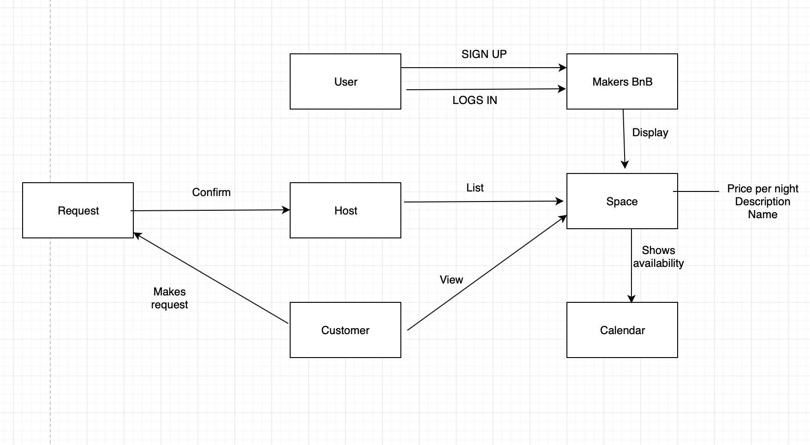

# Makers BnB

## Specifications

```
1. Any signed-up user can list a new space.
2. Users can list multiple spaces.
3. Users should be able to name their space, provide a short description of the space, and a price per night.
4. Users should be able to offer a range of dates where their space is available.
5. Any signed-up user can request to hire any space for one night, and this should be approved by the user that owns that space.
6. Nights for which a space has already been booked should not be available for users to book that space.
7. Until a user has confirmed a booking request, that space can still be booked for that night.
```
## User Stories
```
As a user
I want to sign up to makers BnB
So that I can use the app as a host or customer

As a user
I want to log in
So that I can use the app as a host or customer

As a host
I want to list a new space
So that customers can see my property

As a host
I want to list multiple spaces
So that I can advertise all my spaces

As a host
I want to add all space details
So that customers have enough information to choose my space

As a host
I want to enter in available dates
So that my property is not double booked

As a customer
I want to make a request
So that I can hire a space

As a host
I want to be able to approve a request
So that the space is booked

```
##Domain Model



## Setting up the database

**Enter postgresql and create the database**
* $>psql
* =# CREATE DATABASE "makersbnb";
* =# CREATE DATABASE "makersbnb_test";

**In irb run the following commands to create the tables**
* $>irb
* require './database_connection_setup.rb'
* setup_test_connection
* setup_prod_connection
* drop_tables
* create_tables
